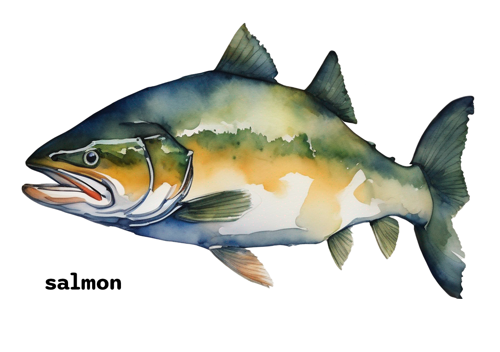

# Salmon-Grasshopper
Salmon stands as an exemplary Open-source Grasshopper plugin, poised to foster seamless collaboration. With a resolute objective, it serves as an avant-garde arena for ideation, seamless integrations, and boundless inspiration. Its essence lies in democratizing ingenious tools, ensuring universal accessibility. As a software artisan, Salmon beckons the community to partake in a symphony of innovation, where intricate concepts harmonize with effortless usability, ultimately orchestrating a tapestry of unparalleled utility and creativity.[AI-generated]

## Documentation

Soon to be added:
- [Introduction](#)
- [Installing the plugin in Grasshopper](#)
- [Parameter overview](#)
- [Component overview](#)

## Tutorials

## Example Files
[![ExampleFiles](https://img.shields.io/badge/Grasshopper-Example%20Files-green?logo=data:image/png;base64,iVBORw0KGgoAAAANSUhEUgAAAEAAAABACAIAAAAlC+aJAAAAAXNSR0IArs4c6QAAAARnQU1BAACxjwv8YQUAAAAJcEhZcwAADsMAAA7DAcdvqGQAAAhfSURBVGhD1Zl7XNPlHse3324wNjYGY9wDAU3tFFJ2OqakcerkUQvRNO2ck+UtT6aQeKijJRZWvjTvqcdLpViZmWamVl7KSj2UGfEK8wIcLuM2LhswNnb77XxkD75AtrHf2Bi9/9A9z+8Zv+fzPN/ne3nGvmi9m/V7hiL/+xplicFsspIGEwaKgMsX2774oIk0mDBQBCSNFp94//csIDCII5JwSIMJA0UAl8cOCefRNGm6zkARQFEsk4GurzKStssMFAEsNttiYbVqLKTpMgNoB3h8tsno0JNeK9C16+xY2IDZARYrKJTbc4o0ba0qNWxbXr1/c7263kx6uzCAIvH+TaqIOEHKJImtaWinL37d+v2x5rBo/rj0oOAwboDYjpsaQAKO72ukLayJTwWbDNaCc9pjexsDZZy/zJANSRLCR5FBPfCxCVlpltFA7F4i49ZXm9paLDtWVu9bW3f/XyXPvR45fGSAk9kDXwqAxStLDesyK7XNN5yPbaKf7moo+qHtX1uiH5oWJPDrfXq+NKHdq2oaakzFhfpxk6XaFktRvm5EiuhqgS5rY3SwgkcG9YYvBRzLa8ydW06bWWyKdTMVXX80YcxEco5dwZcmlDolKPw2vsVi7ZpIb3+l2mJmkFf7UgCHy44f7k8anVwv1LeoGcRj3whoVVvgNJfN/N+ls1rS1YnAj00xyUq9ewaQGui1Fr4fBQ+D9WZ3+MO6SmPOrLJfzmuN7d1MBdnEo8+EIJCNnijFZxfxooAmlXlztvK3SzqBgOLw2CIJFTVIEJPod/Fs6zeHNWRQFwT+1LbTiXf+SUTandAWK5KI4DD7fsnTArCmHcts0NPvrKo9d6IZZ9RqZQ1NFsoUPKQG8PEd4+yAXUpOEY1/Mlim4IZG8SPi+E115tIi/W8/6c4c0rx5YNCgYX5kaBc8LCBvbZ2m3vy3LEVthXHl02XbzwyWhnDhZGA/TXWm1+aUI7chQ7sjFHNiEgUiKacovw2xGas+aJh/s9qMwPyH+wIefTok8S7/niceeFhA/qmW/JOt//2qBeYee7sgdaoMPhGfkegfz2ss+F6L3bDL1AXyzLeiYEVqlbn0cseqf6KGR5r2nHz2yxFCkcMz4aYAHERNg1kRzZcEc620FY6vsthQed1QpzSqlEa8/td8h6Zil6xN0U88H0oanZiNVi7fWSIEGAvA5h7d07gjpwYCsLRYM5iHsZ2Gw8H7AEWxBUIK3hD/8njsukoTEmPyZces+iAOiSdpMIGZAH0bnbemFjuL9UYNfv/4wPBYASop2AXFZsFdBgRyAsSUTRWHw2ZzWK/PK8cRJN93zJIN0TMW37oDruCqANiuqsq45cWq6ES/9HkhMEqUsGIJx+ZzHHHhi5YVs8pwfEm7B3wBBSs/+bH6wXQpNJBeJrgUMHAQC89rNy5VDhkhnJWtwNrDaYilTmdvZV35SbdmUYWT2YO7x4rgsuA3ETRIF0N6FwBHdvaIZvuK6oeny57MVMBOyAOntKjNO1+tqbhuIG178AXsKc/KsRZsFsp55ldCHTibDcollEj/yanet06VvSVmbJoUea8r4EyfeL/pu8/tmL6/iLIlFGDMJOl9DwdisNFAkzSDOc5mdO5484IHr+m19PrP4mNvtxMFHVF+zbB3TV3PazahmJqzPNzmbRCnXlgX5Sek4L4QueCObWOY0k0AfMvjw4ty55V/tFm1an756oUVs14Ke3FrDKO/jgODeIxAQdqdxAwWZG2IRtmOdcG8F6+JRBi58QAuzGqVBrtzMQq6CUB5gYiIOjpIzr3jjwFbvkxEYQqHSB67BqZ++cduUYzisMelS1/ZHfvD6dZduTXwxS9tixk1npRdARKOv4iDNKm9zZ1j4OFUAuX5jpzqA2/X3yyy5JG8x2aHjHpEsmd1LdYeR/aZf4c9sSi0613Dj2dal6QVY8zLu25DJCG9ruFhAW8vq/pwg6pdh0PJgp+998+BMzMV8gje2sWVSOMi4/gL34wcPUEK/0O+0Mkv57RZ6SXY/BXvxmL/Sa8LeFjAlUu6wzsbkBENSRIiTg8bGYCMY8NS5deHNHBiMzNCh94T4KhYQQaVPbUkKsHvrcPxcFaktzc8LOAWNI3m12aXF17QzsxQPP5PufOfMBDsiwv1SyYXj00Lylgb5WJR5qpQpsCKEMUyJxbjaK47kvBUdlivP8DA6pD0bz89+PRB9bG9jaS3N7wiAGazO7fm2XFXJ/wjeOPxBFQkrte4EXGCyXNDti6vwol3VDx0hTMvJ4J89BDXCnS5c8tPHdQsWR+dNicEPpQ8cJnkB8TYjTcWVCSniOHZSa8DPLwDhRfalqaXXvpWO+HvstSpQaSXOQ9NkyFQ0HTvW+DJQ9yup7PSSsqutCeNFmFjUeOSB26BiA4Tcn41DTy5AwjAKGfnr4zIeS+2j7MHyAB6nT3wpIDzJ1oG3yWEv3flxZ7CYwJqyoxfftg0IyP0RqHTj3hMwGfvNSBDhsck7f7CMwJUSuPBrfXTF4UKRf26/MAzAo680zj0HmFyyq3Xmv2ABwQghT75URMyZJQppKsf6esrEWuOvtsQFS+4NzWQdPUvfRWgUppOfayekaHoT9fZlT4JQLA8eUCNDH7EGB9Yv40+CUD5+91RzZT5cl8tP3BfAKreM4c08Xf4wPd3xX0BSHu++VQz/flQF2+7vISbL68qNax/QTnqkUBGF17ewE0BVwv0Jb/qk3x3dm/ijoCrP+u+2t/0al7c8JG+tH4bjAWgWt+/SfXAY9KRqWKBv0/NvwNmM7BYrId3Nkjl3JRJEg7zYtcbMBPw87faPatrZy8LZ3oB6D2YCUi403/hG5FOfvTsf7x7M+d1WKz/A2c0cJ5+V/ZJAAAAAElFTkSuQmCC&style=flat-square)](/ExampleFiles)

## Contributing

Pull requests are welcome. For major changes, please open an issue first to discuss what you would like to change.

Please make sure to update tests as appropriate.

### Code convention
I am following the [Google Style Guides](https://google.github.io/styleguide/).

## License
Plugin banner has been created by a tool called [Expressive Text-to-Image](https://huggingface.co/spaces/songweig/rich-text-to-image) Generation with Rich Text by Songwei Ge, Taesung Park, Jun-Yan Zhu, and Jia-Bin Huang with this prompt:

<kbd>
**Description:**
Create a watercolor painting on coarse white paper that serves as an identity for a digital tool. The painting should focus solely on a single wild salmon fish, with no background elements. The style should be reminiscent of a watercolor painting, with visible brushstrokes and a natural, organic feel.

**Guidelines:**
- **Medium:** Watercolor on coarse white paper.
- **Composition:** The painting should prominently feature a wild salmon fish as the central subject. The fish should be positioned elegantly, showcasing its form.
- **Color Palette:** The primary color of the salmon should be a mixture of shades resembling the natural color of a wild salmon fish. Incorporate subtle orange tones where appropriate, especially on the belly and areas that catch highlights.
- **Background:** Leave the background entirely white, allowing the fish to stand out.
- **Texture:** Emulate the texture of coarse white paper by leaving parts of the paper uncolored. This will contribute to the paper-like aesthetic.
- **Brushstrokes:** The brushstrokes should be visible, capturing the spontaneous and fluid nature of watercolor painting.
- **Details:** Pay attention to the details of the fish's scales, fins, and facial features, while maintaining a loose and artistic representation.
- **Dimensions:** The painting's dimensions should be suitable for its intended use as an identity for a digital tool. High-resolution digital scanning or photography is recommended for accurate reproduction.
</kbd>

The font used in the graphics of the project is [Sono](https://github.com/sursly/sono) by [Ty Finck](https://github.com/sursly).

## About
